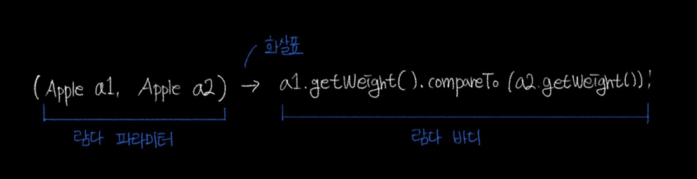
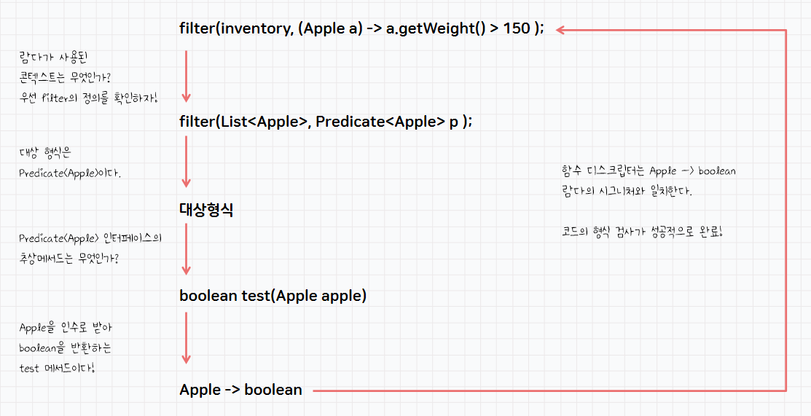

# chapter 03. 람다 표현식

객체 지향 프로그래밍과 함수적 프로그래밍을 혼합함으로써 더욱 효율적인 프로그래밍이 가능하도록 개발 언어가 변하고 있다. 자바 8에서도 함수적 프로그래밍을 위해 람다식을 지원하게 되었다.

> 함수적 프로그래밍 (Functional Programming) 함수형 프로그래밍은 거의 모든 것을 순수 함수로 나누어 문제를 해결하는 기법으로, 작은 문제를 해결하기 위한 함수를 작성하여 가독성을 높이고 유지보수를 용이하게 해준다.
>

## 람다란 무엇인가?

람다식은 **`익명 함수`**(anonymous function)을 생성하기 위한 식이다.

→ 보통의 메서드와 달리 이름이 없으므로 익명이라 표현한다.

→ 람다는 메서드처럼 특정 클래스에 종속되지 않으므로 함수라고 부른다.

객체 지향 언어보다는 함수지향 언어에 가깝다. 자바에서 람다식을 수용한 이유는 자바 코드가 매우 간결해지고, **`컬렉션`**의 요소를 필터링하거나 매핑해서 원하는 결과를 쉽게 집계할 수 있기 때문이다.

람다식의 형태는 매개변수를 가진 코드 블록이지만, 런타임 시에는 익명 구현 객체를 생성한다.

람다를 활용하여 익명 클래스로 구현된 Comparator 객체를 더욱 간결하게 표현해보자

```java
Comparator<Apple> byWeight = new Comparator<>() {
		public int compare(Apple a1, Appple a2) {
				return a1.getWeigt().compareTo(a2.getWeight);
		}
}
```

위의 코드를 람다 표현식으로 변경하면 아래와 같이 더욱 간결하게 표현할 수 있다.

```java
Comparator<Apple> byWeight = 
				(Apple a1, Apple a2) -> a1.getWeight().compareTo(a2.getWeight());
```

아래의 그림처럼 람다는 세 부분으로 이루어진다.



- `파라미터 리스트` → Comaparator의 comapre 메서드 파라미터 (사과 2개)
- `화살표` → 람다의 파라미터 리스트와 바디를 구분
- `람다 바디` → 두 사과의 무게를 비교, 람다의 반환값에 해당하는 표현식

람다의 표현식은 아래와 같다.

```java
( 매개변수 ) -> { 실행문; ... }    // 기본적인 작성 폼

( a ) -> { System.out.prinln(a) } // 예시

a -> { System.out.prinln(a) }     // 하나의 매개변수만 있다면 괄호 생략 가능

a -> System.out.prinln(a)         // 하나의 실행문만 있다면 중괄호 생략 가능

() -> { throw new Exceoption... } // 매개변수가 없다면 빈 괄호를 반드시 사용

( x, y ) -> { return x + y; }

실행문에 return 문만 존재할 경우, 다음과 같이 작성한다.

( x, y ) -> x + y;
```

### 함수형 인터페이스

함수형 인터페이스는 정확히 하나의 추상 메서드를 지정하는 인터페이스이다.

디폴트 메서드가 존재하더라도 추상 메서드가 오직 하나라면 함수형 인터페이스이다.

```java
public interface Predicate<T> {
		boolean test (T t);

		default void printPredicate() {
				System.out.println("Funtional Interface");
		}
}
```

### 함수 디스크립터

함수형 인테페이스의 추상 메서드 시그니처는 람다 표현식의 시그니처를 가리킨다.

람다 표현식의 시그니처를 서술하는 메서드를 함수 디스크립터라고 부른다.

시그니처(signature)란 메서드나 생성자, 필드의 선언부에 나타나는 메서드명과 매개변수의 리스트를 의미한다. 즉, 메서드나 생성자, 필드의 타입과 이름을 결합한 것이다. 시그니처는 메서드나 생성자, 필드를 고유하게 식별할 수 있는 정보를 제공한다.

시그니처는 다음과 같은 형태로 표현된다.

```java
methodName(parameterType1, parameterType2, ..., parameterTypeN)
```

예를 들어, 다음은 `Person`이라는 클래스에서 `setName`이라는 메서드의 시그니처이다.

```java
setName(String name)
```

이처럼 시그니처는 메서드를 고유하게 식별할 수 있는 정보를 제공하므로, 오버로딩(overloading)을 할 때 메서드 이름과 매개변수의 개수, 타입을 함께 고려하여 메서드를 구분하게 된다.

## 실행 어라운드 패턴

실행 어라운드 패턴이란 로직 앞 뒤로 준비/마무리 로직이 들어가는 형식의 코드이다.

데이터베이스의 작업 같은 경우 커넥션을 열고, 로직을 수행하고, 자원을 닫는다.

이러한 형식의 코드를 실행 어라운드 패턴이라고 할 수 있다.

이번 예제는 `try-with-resources` 구문을 사용한다.

`try-with-resources` 구문은 자원을 명시적으로 닫아줄 필요가 없는 코드를 작성할 수 있게 해준다.

```java
try (BufferedReader br = new BufferedReader(new FileReader(path))) {
    return br.readLine();
}

```

위와 같은 코드에서 `BufferedReader`와 `FileReader`는 `AutoCloseable` 인터페이스를 구현하고 있으므로, `try` 블록이 끝나면 자동으로 닫히게 된다.

`try-with-resources` 구문을 사용하면 간결하고 안전한 코드를 작성할 수 있다.

이제 아래의 코드를 람다 표현식을 이용하여 리팩터링 해보겠다.

```java
public String processFile() throws IOException {
		try(BufferedReader br = new BufferedReader(new FilReader("data.txt"))) {
				return br.readLine();
		}
}
```

위의 코드는 `br.readLine()`을 호출하는 방식으로 고정되어 있다. 만약 두 줄을 읽거나 자주 사용되는 단어를 반환하려면 어떻게 해야할까?

앞서 했던 방식대로 `processFile()`의 동작을 파라미터로 넘기는 방법이 있다.

### 함수형 인터페이스를 이용해서 동작 전달

우리는 BufferedReader를 인자로 받고 String을 반환하는 시그니처 즉 BufferedReader → String 과 IOException을 던질 수 있는 시그니처와 일치하는 함수형 인터페이스를 만들어야 한다.

```java
@FunctionalInterface
public interface BufferdReaderProcessor {
		String process(BufferdReader b) throws IOException;
}
```

### 동작 실행

위와 같이 정의한 인터페이스를 processFile()의 동작부분에 인수로 전달하자.

```java
public String processFile(BufferdReaderProcessor p) throws IOException {
		try (BufferedReader br = new BufferedReader(new FileReader("data.txt"))) {
				return p.process(br);
		}
}
```

### 람다 전달

이제 람다를 이용해서 다양한 동작을 processFile 메서드로 전달할 수 있다.

```java
String onLine = processFile((BufferedReader br) -> br.readLine());

String twoLines = processFile((BufferedReader br) -> br.readLine() + br.ReadLine());
```

## 함수형 인터페이스

### Predicate<T>

`java.util.function.Predicate<T>`

디스크립터: `T` → `boolean`

```java
@FunctionalInerface
public interface Predicate<T> { boolean test(T t); }
```

```java
public static <T> List<T> filter(List<T> list, Predicate<T> predicate){
		List<T> result = new ArrayList<>();
		for (T t : list)
				if (predicate.test(t)) result.add(t);
		return result;
}
```

```java
Predicate<Apple> heavyApplePredicate = apple -> apple.getWeight() >= 120;
List<Apple> HeavyApples = fiter(inventory, heavyApplePredicate);

// 혹은

List<Apple> HeavyApples = 
					filter(inventory, apple -> apple.getWeight() >= 120);
```

### Consumer<T>

`java.util.function.Consumer<T>`

디스크립터: `T` → `void`

```java
@FunctionalInterface
public interface Consumer<T> { void accept(T t); }
```

```java
public <T> void forEach(List<T> list, Consumer<T> c) {
		for (T t : list) c.accept(t);
}
```

```java
forEach(Arrays.asList(1,2,3,4,5), (Integer i) -> System.out.println(i));
```

### Function<T, R>

`java.util.function.Function<T, R>`

디스크립터: `T` → `R`

```java
@FunctionalInterface
public interface Function<T, R> { R apply(T t); }
```

```java
// T 타입 리스트를 R 타입 리스트로 반환
public <T, R> List<R> map(List<T> list, Function<T, R> f){
		List<R> result = new ArrayList<>();
		for (T t : list) result.add(f.apply(t));
		return result;
}
```

```java
List<Integer> I = map(Arrays.asList("lambdas", "in", "action"),
											(String s) -> s.length());

// 혹은

List<Integer> I = map(Arrays.asList("lambdas", "in", "action"), String::length);
```

### 기본형 특화

제네릭에는 참조형만 대입될 수 있다. 제네릭의 내부 구현 때문에 어쩔 수 없는 일이다.

따라서 자바에서는 기본형을 참조형으로 변환하는 `박싱`(boxing) 기능을 제공한다. 반대로 참조형은 기본형으로 변환하는 기능을 `언박싱`(unboxing)이라고 한다.

또한 프로그램에서 편리하게 코드를 구현할 수 있도록 박싱과 언박상이 자동으로 이루어지는 `오토박싱`(autoboxing)이라는 기능도 제공한다.

예를 들면 아래와 같은 코드에서는 기본형 `int`가 참조형 `Integer`로 오토박싱 된다.

```java
List<Integer> list = Arrays.asList(1, 2, 3, 4, 5);
```

박싱한 값은 기본형을 감싸는 래퍼(Wrapper)이며 힙에 저장된다. 따라서 박싱한 값을 기본형보다 메모리를 더 소비하며 기본형을 가져올 때도 메모리를 탐색하는 과정이 필요하다.

자바 8에서는 이 오토박싱 동작을 피할 수 있는 함수형 인터페이스를 제공한다.

```java
public interface IntPredicate { boolean test(int t); }
```

```java
IntPredicate evenNumbers = i -> i & 2 == 0;
evenNumbers.test(1000); // 박싱 없음

Predicate<Integer> oddNumbers = i -> i % 2 != 0;
System.out.println(oddNumbers.test(1000)); // 박싱
```

`Predicate` → IntPredicate, DoublePredicate, …

`Consumer` → IntConsumer, DoubleConsumer, …

`Function` → IntFunction<R>, IntToDoubleFunction, …

### 형식검사



### 지역 변수 사용

람다 표현식은 자신이 정의된 블럭 외부의 변수(자유 변수)를 사용할 수 있다.

이와 같은 동작을 람다 캡처링이라 부른다.

람다에서 참고하는 지역 변수는 final로 선언되거나 실질적으로 final처럼 취급 되어야 한다.

```java
int portNumber = 8080;
// 컴파일 에러: Variable used in lambda expression should be final or effectively final
Runnable r = () -> System.out.println(portNumber); 
portNumber = 123123;
```

왜??

람다식은 함수형 인터페이스를 구현하는 익명 클래스의 인스턴스로 컴파일 된다.

따라서 람다식이 참조하는 지역변수가 수정되면, 람다식이 참조하는 변수가 수정되는 것이 아니라, 익명 클래스의 인스턴스가 참조하는 변수가 수정되는 것이다.

람다에서 캡처한 변수가 final이 아닌 경우, 컴파일러가 캡처된 변수를 복사해서 사용하게 된다.

이 경우, 캡처된 변수의 값이 변경되어도 람다식 내부에서는 변경된 값을 참조하지 않게 된다.