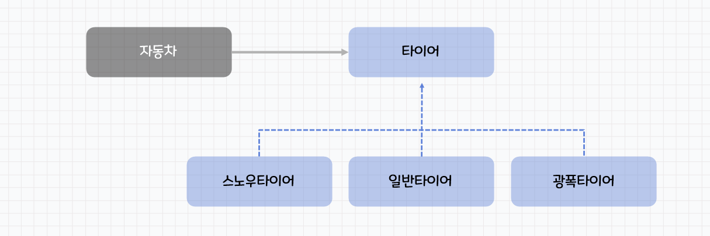

# DIP (Dependency Inversion Principle) ; 의존 역전 원칙
추상화에 의존해야 하며, 구체화에 의존하면 안된다.

구체 클래스에 의존하지 말고, 추상 클래스나 인터페이스에 의존해야 한다.

DIP란 Dependency Inversion Principle의 약어로, 의존성 역전 원칙을 말한다. 이 원칙은 객체 지향 설계에서 중요한 원칙 중 하나이며, 객체들 간의 결합도를 줄여 유연하고 확장 가능한 코드를 작성할 수 있도록 한다.

의존성(Dependency)?

객체의 세계에서 협력은 필수적이며, 객체가 협력한다는 것은 객체 간의 의존성이 존재한다는 것이다. 여기서 의존성이란 파라미터나 리턴 값 또는 지역변수 등으로 다른 객체를 참조하는 것이다.

- 컴파일타임 의존성
    - 코드를 컴파일하는 시점에 결정되는 의존성
    - 인터페이스가 아닌 구체 클래스에 의존하면 컴파일 타임 의존성을 갖게 된다.
    - 결합도가 높으며 변경에 유연하지 못하다.
- 런타임 의존성

  코드를 실행하는 시점에 결정되는 의존성

  추상화된 클래스나 인터페이스에 의존할 때 런타임 의존성을 갖게 된다.


의존성의 역전?


해당 설계는 자동차가 하위 모듈인 스노우 타이어에 의존하는 상태이다.

풀어서 설명하면 자동차가 스노우타이어를 끼우기 위해 설계되어 있는 상태라는 것이다.

이런 상황을 의존성 역전이라 한다.

만약 날씨가 풀려 스노우타이어를 일반 타이어로 교체하려 한다.

위 처럼 의존성이 역전되어 있는 상태라면 스노우타이어를 일반타이어로 갈아 끼우기 위해 자동차를 일반타이어에 맞게 변경시켜야 한다.

이게 무슨 말도 안되는 일인가?

해당 문제를 해결하기 위해 타이어를 추상화 시킨다.



자동차는 타이어를 끼울 수 있게 설계되어 있다.

이 타이어의 형태에 맞게 스노우, 일반, 광폭 타이어를 설계하는 것이다.

이제 타이어를 교체하기 위해 자동차의 변경하는 일은 없어진다. 모든 종류의 타이어가 타이어의 설계를 따른다. 이는 모든 타이어가 자동차에 맞게 설계되었다는 의미이고 동시에 모든 타이어는 자동차에 끼울 수 있게 설계되었다는 의미이다.

DIP를 적용하기 위해서는 다음과 같은 규칙을 따라야 한다.

1. 상위 수준 모듈은 하위 수준 모듈에 의존해서는 안 된다. 둘 모두 추상화에 의존해야 한다.
2. 추상화는 구체적인 사항에 의존해서는 안 된다. 구체적인 사항이 추상화에 의존해야 한다.

간단한 예시를 들어보면, 학생 정보를 처리하는 예제를 생각해보겠다. 학생 정보는 이름, 학번, 전화번호 등의 정보로 이루어져 있으며, 이 정보들을 다루기 위해 데이터베이스와 연결해야 한다.

DIP를 적용하지 않은 경우, 학생 정보를 처리하는 클래스에서 직접 데이터베이스와 연결하는 코드를 작성할 수 있다. 이 경우, 학생 정보를 처리하는 클래스와 데이터베이스가 강한 결합을 가지게 되어 유지보수가 어려워지며, 코드를 확장하기도 어렵다.

```java
public class StudentRepository {
    private Connection connection;

    public StudentRepository() {
        connection = DriverManager.getConnection("jdbc:mysql://localhost:3306/student", "root", "password");
    }

    public List<Student> getAllStudents() throws SQLException {
        List<Student> students = new ArrayList<>();
        Statement statement = connection.createStatement();
        ResultSet resultSet = statement.executeQuery("SELECT * FROM students");

        while (resultSet.next()) {
            int id = resultSet.getInt("id");
            String name = resultSet.getString("name");
            String studentNumber = resultSet.getString("student_number");
            String phoneNumber = resultSet.getString("phone_number");
            students.add(new Student(id, name, studentNumber, phoneNumber));
        }

        return students;
    }
}

```

DIP를 적용한 경우, 학생 정보를 처리하는 클래스는 데이터베이스와 직접적으로 연결하지 않으며, 인터페이스를 통해 의존성을 주입받는다. 이를 통해 클래스는 데이터베이스와 느슨한 결합을 가지게 되어 유지보수와 확장성이 높아진다.

```java
public interface StudentDataSource {
    List<Student> getAllStudents() throws SQLException;
}

public class StudentRepository {
    private StudentDataSource dataSource;

    public StudentRepository(StudentDataSource dataSource) {
        this.dataSource = dataSource;
    }

    public List<Student> getAllStudents() throws SQLException {
        return dataSource.getAllStudents();
    }
}

public class MySqlStudentDataSource implements StudentDataSource {
    private Connection connection;

    public MySqlStudentDataSource() throws SQLException {
        connection = DriverManager.getConnection("jdbc:mysql://localhost:3306
```

### Reference

[[OOP] 의존성(Dependency)이란? 컴파일타임 의존성과 런타임 의존성의 차이 및 비교](https://mangkyu.tistory.com/226)

[[Spring] 다양한 의존성 주입 방법과 생성자 주입을 사용해야 하는 이유 - (2/2)](https://mangkyu.tistory.com/125)

[11장 DIP: 의존성 역전 원칙](https://wikidocs.net/167372)